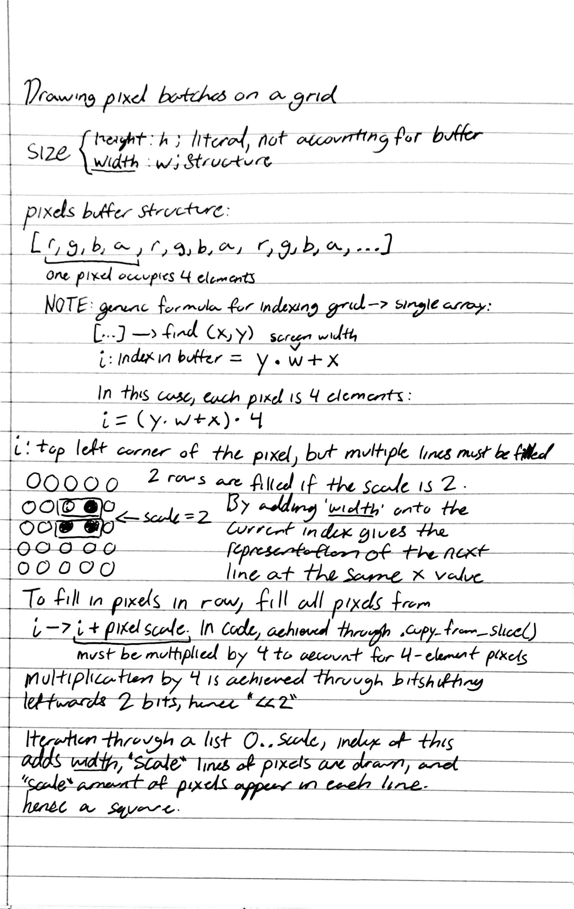

# Rust Cellular Automata

A cellular automata simulation built from scratch using **pixels** and **winit**.

Since **pixels** uses a single buffer rather than a grid to read/write pixels, 
much of the custom pixel drawing interface may be a bit confusing.

This image below details the thought process behind the `draw_pixels_on_grid` method:

